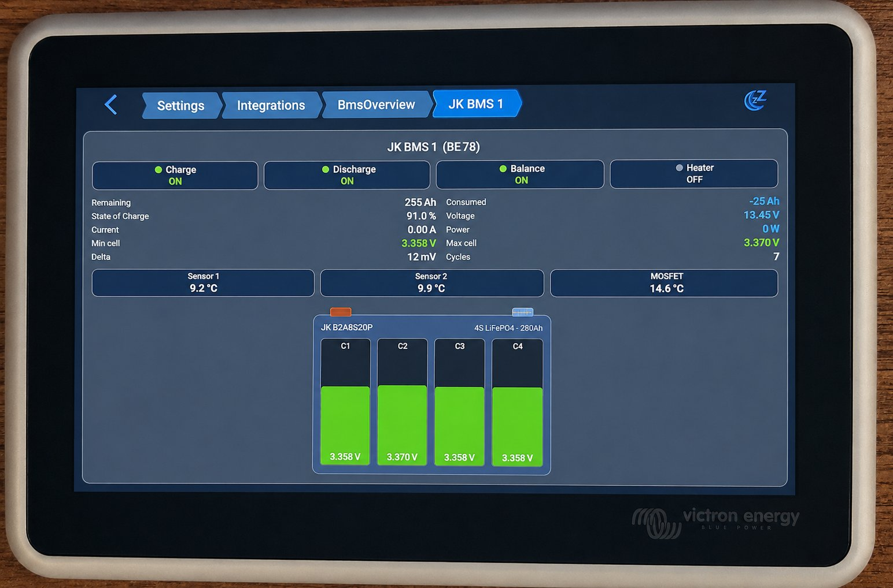

# BmsOverview (experimental)

A GUIv2 UI plugin that auto-discovers all dbus-serialbattery batteries and shows a
compact card per battery in a grid, with drill-down to a full detail panel.
Appears under **Settings → Integrations → UI Plugins → BmsOverview**.


Tapping a card opens the full per-battery panel as a detail page:



## How discovery works (no hardcoded service UIDs)

1. Read the system battery list from `com.victronenergy.system/Batteries`.
2. Build each service UID with `BackendConnection.serviceUidFromName(id, instance)`.
3. Keep only services whose `/ProductId == 0xBA77` (the id Victron reserved for
   dbus-serialbattery), which filters out the BMV and other battery monitors.

The full per-battery panel (`BmsPanel.qml`) is reused as the drill-down detail page
via `pageManager.pushPage`. Both auto-discovery and drill-down are confirmed working
from a plugin on a Venus OS GX.

## Files

```
BmsOverview/
├── BmsOverview_PageSettings.qml   Discovery + overview grid + drill-down
├── BmsCard.qml                    One compact summary card
└── BmsPanel.qml                   Full detail panel (shared with BmsDashboard)
```

## Status and limitations

- Proof of concept.
- The grid fills the screen for typical counts (2, 4, 6, 8); very large counts would
  want a scrollable layout, which is not added yet.
- Battery names come straight from dbus-serialbattery's device names.

## Deploy

```bash
ssh root@<gx-ip> "mkdir -p /data/apps/available/BmsOverview"
scp BmsOverview/*.qml root@<gx-ip>:/data/apps/available/BmsOverview/

ssh root@<gx-ip>
cd /data/apps/available/BmsOverview
python3 /opt/victronenergy/gui-v2/gui-v2-plugin-compiler.py \
    -n BmsOverview \
    --min-required-version v1.2.13 \
    --settings BmsOverview_PageSettings.qml
mkdir -p gui-v2 && mv -f BmsOverview.json gui-v2/
ln -sf /data/apps/available/BmsOverview /data/apps/enabled/BmsOverview
svc -t /service/start-gui   # or: reboot
```

Requirements are listed in the [project README](../README.md).
