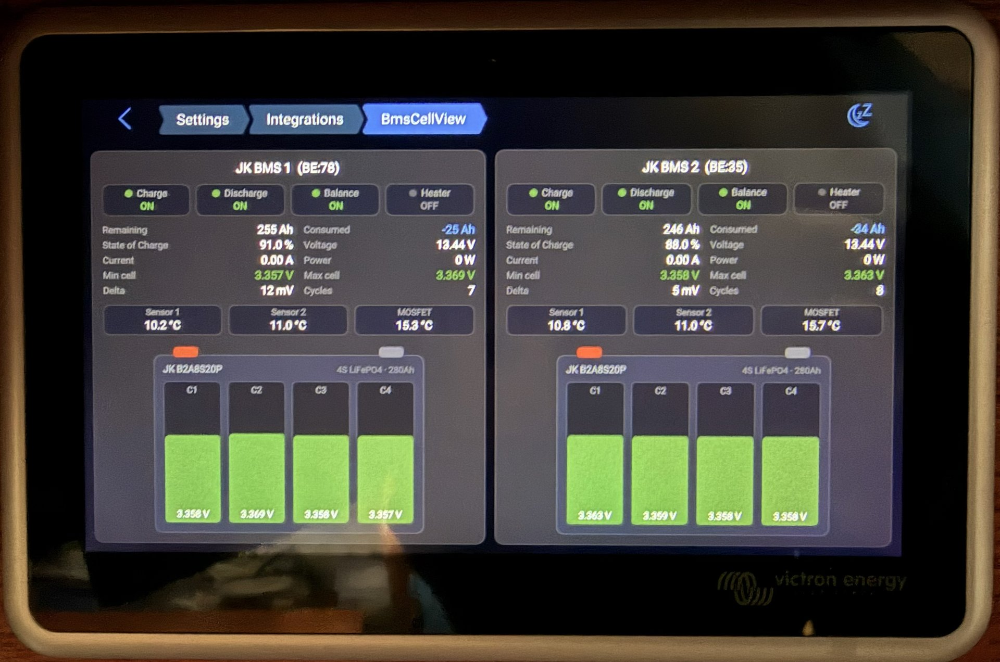

# Venus OS GUIv2 BMS plugins

Two custom [Venus OS GUIv2](https://github.com/victronenergy/gui-v2) UI plugins for
visualizing JK BMS data (via [dbus-serialbattery](https://github.com/mr-manuel/venus-os_dbus-serialbattery))
on a Victron GX device. Built and running on an Ekrano GX.

Both are proper plugins built against Victron's official GUIv2 plugin framework
(`type:1` settings integrations), not GUI hacks, so they survive firmware updates.

## Plugins

### [BmsDashboard](BmsDashboard/): detailed side-by-side view

Two BMS shown side by side as batteries, with full per-cell detail, status,
temperatures and capacity. Uses a fixed battery list.

### [BmsOverview](BmsOverview/): multi-BMS auto-discovery with drill-down

Discovers all dbus-serialbattery batteries automatically and shows a compact card
per battery in a grid. Tapping a card opens the full detail panel. Scales to many
batteries. Experimental / proof of concept.

Each plugin folder has its own README and deploy instructions.

## Requirements

- Venus OS **v3.70~45 or newer**
- Venus OS **"Large" image** (provides Python 3, `lupdate`, `lrelease`, `rcc` for the plugin compiler)

## How the plugins are structured

Both follow the same pattern: a `*_PageSettings.qml` entry page plus a reusable
`BmsPanel.qml` that renders one battery from standard dbus-serialbattery paths
(`/Soc`, `/Voltages/CellN`, `/System/MinCellVoltage`, `/Io/AllowToCharge`,
`/Balancing`, `/Heating`, etc.). The compiler scans the plugin folder
(non-recursively), so all `.qml` files sit flat in it.

## Credits

Huge thanks to [@mr-manuel](https://github.com/mr-manuel) for dbus-serialbattery,
which exposes everything cleanly on dbus, and to the Victron team for the
[GUIv2 plugin framework](https://github.com/victronenergy/gui-v2/wiki/How-to-create-GUIv2-UI-Plugins).

## License

MIT, see [LICENSE](LICENSE).
