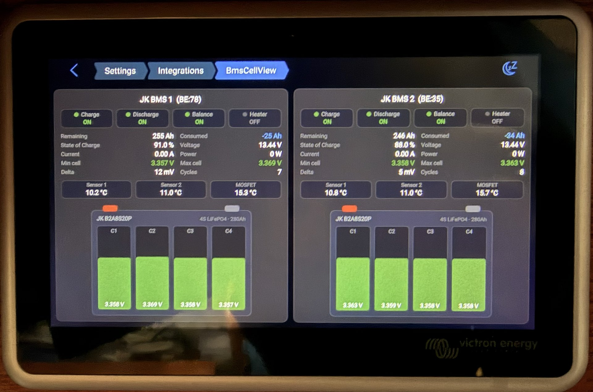
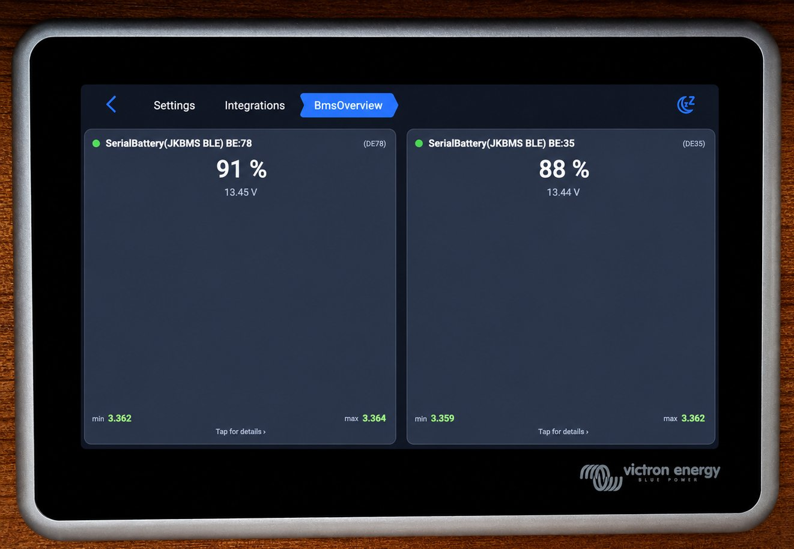

# BmsDashboard — a GUIv2 UI plugin for Venus OS

A custom [Venus OS GUIv2](https://github.com/victronenergy/gui-v2) UI plugin that
shows two JK BMS side by side as batteries, with live per-cell data pulled from
[dbus-serialbattery](https://github.com/mr-manuel/venus-os_dbus-serialbattery).
Built and running on a Victron Ekrano GX.



It appears under **Settings → Integrations → UI Plugins → BmsDashboard**.

## What it shows (per battery)

- **4 cell voltages** with green/amber/red thresholds and a 3.3 V nominal marker
- **Status:** Charge / Discharge / Balance / Heater (LED + state)
- **Three temperatures:** two battery probes + MOSFET
- **State of Charge, voltage, current, power, min/max cell, delta, cycles, remaining/consumed Ah**

It's a proper plugin built against Victron's official GUIv2 plugin framework
(a `type:1` settings integration), not a GUI hack — so it survives firmware updates.

The repo also includes **BmsOverview**, an experimental variant that auto-discovers
all dbus-serialbattery batteries and adds an overview grid with drill-down (see below).

## Files

```
BmsDashboard/
├── BmsDashboard_PageSettings.qml   Entry page (bmsList + layout)
└── BmsPanel.qml                    One BMS panel (status, stats, temps, battery)
```

Only these two QML files are deployed to the device. The compiler scans the
current directory (not recursively), so both files must sit flat in the
`BmsDashboard/` folder.

## Configure your BMS

Open `BmsDashboard/BmsDashboard_PageSettings.qml` and edit `bmsList` with your own
dbus service names and labels. Find your service names on the device with:

```bash
dbus -y | grep com.victronenergy.battery
```

```qml
readonly property var bmsList: [
    { service: "dbus/com.victronenergy.battery.ble_XXXXXXXXXXXX", label: "JK BMS 1", mac: "..:.." },
    { service: "dbus/com.victronenergy.battery.ble_YYYYYYYYYYYY", label: "JK BMS 2", mac: "..:.." }
]
```

`gui-v2` expects the `dbus/` prefix on the service UID. The plugin reads standard
dbus-serialbattery paths (`/Soc`, `/Dc/0/Voltage`, `/Voltages/CellN`,
`/System/MinCellVoltage`, `/Io/AllowToCharge`, `/Balancing`, `/Heating`, etc.),
so it should work with any BMS the driver exposes — adjust the panel to taste.

## Requirements

- Venus OS **v3.70~45 or newer**
- Venus OS **"Large" image** (provides Python 3, `lupdate`, `lrelease`, `rcc`)

## Deploy

```bash
# 1. Copy the plugin folder to the device
scp -r BmsDashboard root@<gx-ip>:/data/apps/available/

# 2. SSH in and compile on the device
ssh root@<gx-ip>
cd /data/apps/available/BmsDashboard
python3 /opt/victronenergy/gui-v2/gui-v2-plugin-compiler.py \
    -n BmsDashboard \
    --min-required-version v1.2.13 \
    --settings BmsDashboard_PageSettings.qml
mkdir -p gui-v2 && mv -f BmsDashboard.json gui-v2/

# 3. Enable and restart the GUI
ln -sf /data/apps/available/BmsDashboard /data/apps/enabled/BmsDashboard
svc -t /service/start-gui   # or: reboot
```

The device only reads `gui-v2/BmsDashboard.json` (it decodes a base64 `.rcc`
embedded inside it). To upgrade later, replace the `.qml` files, recompile,
copy the new JSON into `gui-v2/`, and restart `start-gui`.

## Color coding

| Color | Range | Meaning |
|---|---|---|
| 🟢 Green | 3.10 V < V < 3.50 V | OK |
| 🟡 Amber | V ≥ 3.50 or V ≤ 3.10 | Warning |
| 🔴 Red | V ≥ 3.60 or V ≤ 3.00 | Critical |

Adjust the thresholds in `cellColor()` in `BmsPanel.qml`.

## BmsOverview (experimental): auto-discovery + drill-down

`BmsDashboard` above uses a fixed list of batteries. `BmsOverview/` is an experimental
variant that scales to any number of batteries and discovers them automatically.



It shows a compact card per battery in a grid (SoC, voltage, min/max cell, status dot).
Tapping a card opens the full panel as a detail page:


**How discovery works (no hardcoded service UIDs):**

1. Read the system battery list from `com.victronenergy.system/Batteries`.
2. Build each service UID with `BackendConnection.serviceUidFromName(id, instance)`.
3. Keep only services whose `/ProductId == 0xBA77` (the id Victron reserved for
   dbus-serialbattery), which filters out the BMV and other battery monitors.

The full per-battery panel (`BmsPanel.qml`) is reused as the drill-down detail page via
`pageManager.pushPage`. Both auto-discovery and drill-down are confirmed working from a
plugin on a Venus OS GX.

**Status and limitations:**

- Proof of concept. The grid fills the screen for typical counts (2, 4, 6, 8); very
  large counts would want a scrollable layout, which is not added yet.
- Battery names come straight from dbus-serialbattery's device names.

Deploy is the same as BmsDashboard but with the `BmsOverview/` folder and `-n BmsOverview`.
It has three QML files: the page, `BmsCard.qml`, and `BmsPanel.qml`.

## Notes

- UI plugins currently load only on the local GX display; WASM/browser support
  (VRM remote console) is planned by Victron but not implemented yet.
- See [`images/mockup.svg`](images/mockup.svg) for a clean vector mockup of the layout.

## Credits

Huge thanks to [@mr-manuel](https://github.com/mr-manuel) — none of this would be
possible without dbus-serialbattery exposing everything cleanly on dbus — and to
the Victron team for the [GUIv2 plugin framework](https://github.com/victronenergy/gui-v2/wiki/How-to-create-GUIv2-UI-Plugins).

## License

MIT — see [LICENSE](LICENSE).
